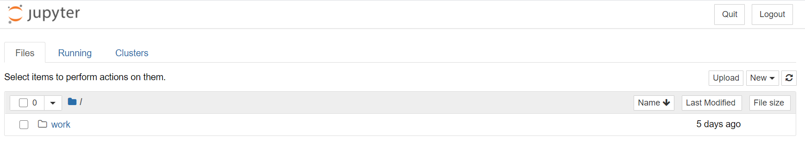

### Purpose
This effort is made to demonstrate part of the work described in paper 
[Urban Planning and Smart City Decision
Management Empowered by Real-Time
Data Processing Using Big Data Analytics](https://www.researchgate.net/publication/327524100_Urban_Planning_and_Smart_City_Decision_Management_Empowered_by_Real-Time_Data_Processing_Using_Big_Data_Analytics#fullTextFileContent)
for "Big Data" course project. 

The paper shows a research and study on how to utilize "Big Data" technologies and
frameworks in implementing Smart Cities and Urban planning systems and how it 
could improve the performance and throughput of data to be analyzed.

This projects demonstrates the batch processing part described in the document 
using Hadoop and HBase and our project group decided to work on "Water Meters" data.

#### Water Meters
The research paper  lists the resources from where the data sets where fetched,
[Water Meters](http://data.surrey.ca/dataset/water-meters/resource/99fe8786-6329-49f7-ae92-2c3b8f6e4778)
is a CSV file containing all meters installed in City of Surrey, it only contains information
where the meters are installed and if they are still in service or not.

We were looking for the source to get the readings for those equipments and we found
[City of Surrey Mapping Online System](https://cosmos.surrey.ca/external/) which provides
a REST endpoints to get the readings and other attributes related to the meters.

### Expected Outcome
The expected behavior we wanted to demonstrate is to import the "normalized" meters readings
to Hadoop and HBase to run analyses tasks using Apache Spark against those readings.

We were able to use Hadoop map-reduce job to do the initial mapping and normalization
for readings data then importing it to HBase but we will apply the analyses part of
work in future.

### Project components     
* Docker: to run Hadoop and HBase cluster, utilizes jupyter lab container to demonstrate
 the code and use it as a utility to upload CSV files.
* Python-3.8: implementing Map-Reduce Hadoop jobs
* Shell scripts: to run back-end jobs which listens to files changes and running 
Hadoop and HBase jobs.

### Docker images
The Docker images used in this demo are based on Docker images built in project
https://github.com/big-data-europe/docker-hbase, additionally jupyter/pyspark-notebook
image was used to run the jupyter lab.

### Running the application
A docker compose file is introduced to ignite the project containers, below
command runs the docker containers:
```shell script
docker-compose -f docker-compose.yml up -d
``` 
You can shutdown the containers by executing the below command,
you can additionally pass -v and --rmi all options to clean all
volumes and created images.
```shell script
docker-compose -f docker-compose.yml down
```

### Demo Steps
Once the docker containers are started
* trace the logs of the jupyter notebook container to get the notebook URL, 
the last line displays the required URL
```shell script
docker logs -t pyspark_notebook
``` 
You should see the notebook main page like below:

* Navigate through the notebook files explorer to /work/uploads,
you can have a look into the shell scripts used and Python Map-Reduce jobs
under /work/hadoop and /work/hbase
* Download a water meter dataset from the [Water Meters](http://data.surrey.ca/dataset/water-meters/resource/99fe8786-6329-49f7-ae92-2c3b8f6e4778)
* After navigating through notebook to /work/uploads upload the downloaded CSV to 
the upload folder.
* Uploading a file should trigger a Map-Reduce hadoop job.
* You can trace the job by tailing a log file inside the name node container:
```shell script
docker exec -it namenode bash
```
Then inside the container tail the log file
```shell script
tail -f upload_logs.txt
```
* You can trace hbase import job logs
```shell script
docker exec -it hbase bash
```
Then tail import log file:
```shell script
tail -f import_logs.txt
```
* You can check the imported records into hbase table, bash into hbase container
then open hbase shell to scan the table:
```shell script
docker exec -it hbase bash
hbase shell
>scan 'water_meters', {LIMIT => 1}
```
You should see the first record as below:
```shell script
ROW                                          COLUMN+CELL
 1000928957-2020-10-28                       column=basic:ACCOUNT_NO, timestamp=1610903090138, value=440853
 1000928957-2020-10-28                       column=basic:FACILITYID, timestamp=1610903090138, value=1000928957
 1000928957-2020-10-28                       column=location:HOUSE_NO, timestamp=1610903090138, value=11576
 1000928957-2020-10-28                       column=location:Latitude, timestamp=1610903090138, value=49.178048
 1000928957-2020-10-28                       column=location:Longitude, timestamp=1610903090138, value=-122.901761\x09
 1000928957-2020-10-28                       column=location:STREET_NO, timestamp=1610903090138, value=96A AVE
 1000928957-2020-10-28                       column=reading:LAST_READ, timestamp=1610903090138, value=1435
 1000928957-2020-10-28                       column=reading:LAST_READ_DT, timestamp=1610903090138, value=2020-10-28
1 row(s) in 1.1870 seconds
```

### HBase Table Structure
The final table "water_meters" which hold the meters reading structure is:

|Columns Group|Columns|Description|
|---|---|---|
|basic|ACCOUNT_NO,FACILITYID|Holds the meter ID|
|location|HOUSE_NO,Latitude,Longitude,STREET_NO|Meter location|
|reading|LAST_READ,LAST_READ_DT|Last reading value and date|

### Map-Reduce Python scripts
* [Mapper](/scripts/hadoop/water_meters_mapper.py) accepts each line in water meters
csv file, read all line fields except: FOLIO, STATUS, GPS, IMAGE, and LOTLINK, adds the
last reading value and last reading date from the REST web service by the facility ID, then
generates the final line to be passed to the reduce job, it also add additional key that will
be used as the key for the record in HBase which is the result of concatenation between
FACILITYID and LAST_READ_DT, this will help in not inserting the first reading multiple times
to the HBase table. 
* [Reducer](/scripts/hadoop/water_meters_reducer.py): will pass the record as an
output only if the Min-Max normalization equation against the reading falls within 0 and 1. 